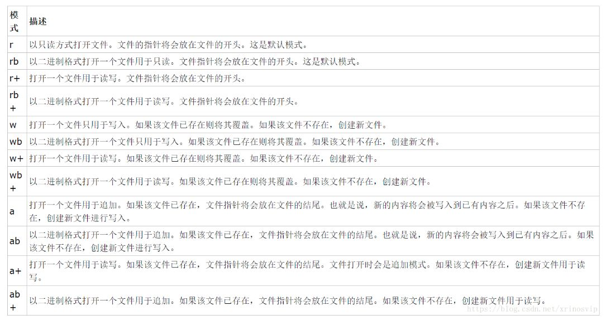

## 打开文件
### 读写文件
```
# 读文件，with的作用就是调用close()方法
with open('','r') as f:  
with open('','r') as f1:
with open('','r') as f2":
    print(f.read())

# 写文件
with open('','w') as f:
    f.write('World')
```
文件的读写方式列表：


## json模块


## 字典、数组


## 文件路径
1. ../表示当前文件所在目录的上一级目录
2. ./表示当前文件所在的目录（可以省略）
3. /表示当前站点的根目录

## 